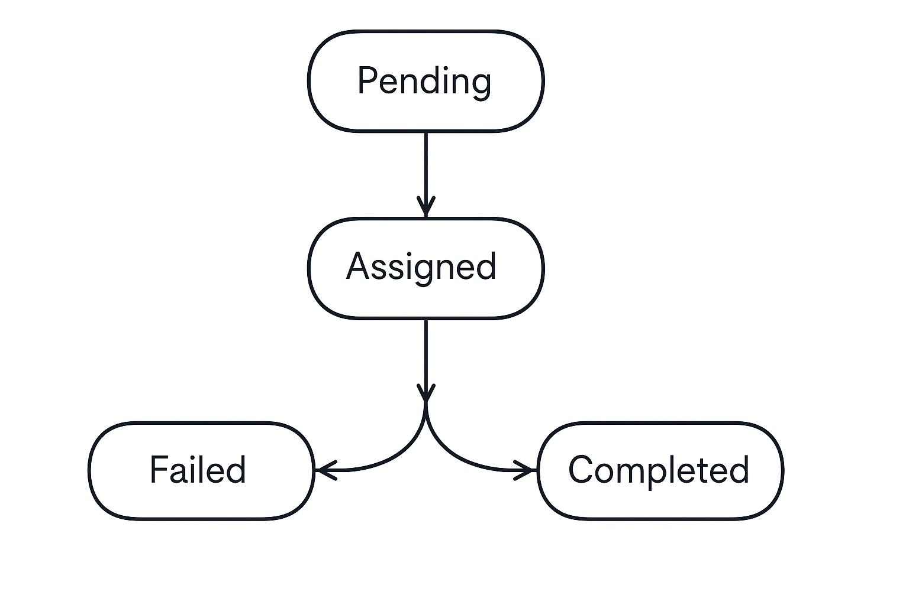

## 1) Service responsibility

The **Fulfillment Service** is responsible for operational fulfillment execution via a **single human-worker task per order**.

**Responsibilities**
- Create exactly **one task per order** (**idempotent** by `orderId`).
- Orchestrate tasks to human workers.
- Enforce: **each worker can have at most 5 active tasks** simultaneously.
  - Active = `ASSIGNED` + `IN_PROGRESS`
- Allow workers to update task status.
- Notify the **Order Service** when task status changes so the Order state is updated.

**High-level flow (chart)**


## 2) API endpoints

### 2.1 Create task (called by Order Service)

**POST** `/tasks`

**Request**
```json
{ "orderId": "ORD-123" }
```

**Behavior**
- If no task exists for `orderId`: create a new task with status `CREATED`.
- If a task already exists for `orderId`: return the existing task (**idempotent**).

**Responses**
- `201 Created` (new task)
- `200 OK` (task already existed)

**Response**
```json
{
  "taskId": "1",
  "orderId": "1",
  "status": "Pending",
}
```

---

### 2.2 Assign a task

**POST** `/Assign/{taskId}`

**Behavior**
- Enforces **max 5 active tasks** for the worker (`ASSIGNED`).
- If allowed, assigns the oldest available task (`Pending`) to the worker.

**Responses**
- `200 OK` — task assigned
- `400 Bad Request` — Couldn't assign the task to a worker

**Response (200)**
```json
{
  "taskId": "1",
  "orderId": "1",
  "status": "ASSIGNED",
  "workerId": "W-7"
}
```

**Error (400)**
```json
{ "code": "ALL_WORKERS_CAPACITY_EXCEEDED", "message": "No available workers." }
```

---

### 2.3 Update task status (worker processing)

**PATCH** `/tasks/{taskId}/status`

**Request examples**
```json
{ "status": "IN_PROGRESS" }
```

```json
{ "status": "COMPLETED" }
```

```json
{ "status": "REJECTED" }
```

**Valid transitions**
- `ASSIGNED' -> COMPLETED | REJECTED`

**Responses**
- `200 OK`
- `400 Bad Request` — invalid transition
- `404 Not Found`

---

### 2.4 Update order status

**PATCH** `/orders/{orderId}/status`

**Request examples**
```json
{ "status": "IN_PROGRESS" }
```

```json
{ "status": "COMPLETED" }
```

```json
{ "status": "REJECTED" }
```

**Valid transitions**
- `ASSIGNED -> IN_PROGRESS`
- `IN_PROGRESS -> COMPLETED | REJECTED`

**Responses**
- `200 OK`
- `400 Bad Request` — invalid transition
- `404 Not Found`

---

### 2.5 Read endpoints (useful for debugging/tests)

## 3) Task states

- **pending:** Fulfillment task is created but not assigned to any workers yet.
- **assigned:** Fulfillment task created in fulfillment service, task in queue or assigned to worker, waiting for worker to start on task
- **completed:** Worker finished the task, order has been fulfilled
- **failed:** task could not be completed (bad request), no fulfillment

## 3.1) Task state machine :


## 4) Initial TDD tests (failing first)

### Test suite A — Task creation (CreateTaskTests)
1. **CreateTask creates a new task when `orderId` is new**
   - Given: `orderId` does not exist
   - When: `CreateTask(orderId)` is called
   - Then: returned task has `Status = "Pending"`

2. **CreateTask is idempotent by `orderId`**
   - Given: a task already exists for the same `orderId`
   - When: `CreateTask(orderId)` is called again with the same `orderId`
   - Then: both calls return the **same** `Id`

---

### Test suite B — Assignment & worker capacity (AssignTaskTests)
3. **AssignTask throws when task is not found**
   - Given: taskId does not exist
   - When: `AssignTask(taskId)` is called
   - Then: throws `Exception("Task not found")`

4. **AssignTask throws when task is already assigned**
   - Given: task exists with `Status = "Assigned"` and already has `WorkerId`
   - When: `AssignTask(taskId)` is called
   - Then: throws `Exception("Task already assigned")`

5. **AssignTask assigns based on cursor when a worker has capacity**
   - Given: cursor is set to a known position (e.g., `Current = 0`)
   - And: task exists and is unassigned
   - And: worker at cursor position has capacity (< 5 active tasks)
   - When: `AssignTask(taskId)` is called
   - Then: task becomes `Status = "Assigned"`
   - And: `WorkerId` is persisted in DB
   - And: cursor advances to the next value

6. **AssignTask skips workers at capacity and assigns the next available worker**
   - Given: cursor starts at worker 1
   - And: worker 1 has 5 active tasks (at capacity)
   - And: worker 2 has 5 active tasks (at capacity)
   - And: worker 3 has 4 active tasks (has capacity)
   - When: `AssignTask(taskId)` is called
   - Then: task is assigned to worker 3
   - And: cursor updates to reflect the worker used

7. **AssignTask throws when all workers are at capacity**
   - Given: all workers have 5 active tasks
   - And: task exists and is unassigned
   - When: `AssignTask(taskId)` is called
   - Then: throws `Exception("No available workers")`
   - And: task remains unassigned (`WorkerId` is still `null`)

---

### Test suite C — Status transitions & validation (UpdateTaskStatusTests)
8. **UpdateTaskStatus throws when task is not found**
   - Given: taskId does not exist
   - When: `UpdateTaskStatus(taskId, dto)` is called
   - Then: throws `Exception("Task not found")`

9. **UpdateTaskStatus throws when worker is not assigned to the task**
   - Given: task exists and is assigned to worker A
   - When: `UpdateTaskStatus(taskId, dto)` is called using worker B
   - Then: throws `Exception("Worker not assigned to this task")`

10. **UpdateTaskStatus throws when task is already processed**
   - Given: task exists with `Status = "Completed"` or `Status = "Failed"`
   - When: `UpdateTaskStatus(taskId, dto)` is called
   - Then: throws `Exception("Task already processed")`

11. **UpdateTaskStatus rejects invalid transitions**
   - Given: task exists with `Status = "Assigned"`
   - When: attempting transition to `Status = "Pending"`
   - Then: throws `Exception("Invalid Transition")`

12. **UpdateTaskStatus allows valid transitions to Completed**
   - Given: task exists with `Status = "Assigned"` and worker is assigned
   - When: `UpdateTaskStatus(taskId, dto(Status="Completed"))` is called
   - Then: status updates to `"Completed"`
   - And: change is persisted in DB

13. **UpdateTaskStatus allows valid transitions to Failed**
   - Given: task exists with `Status = "Assigned"` and worker is assigned
   - When: `UpdateTaskStatus(taskId, dto(Status="Failed"))` is called
   - Then: status updates to `"Failed"`
   - And: change is persisted in DB
